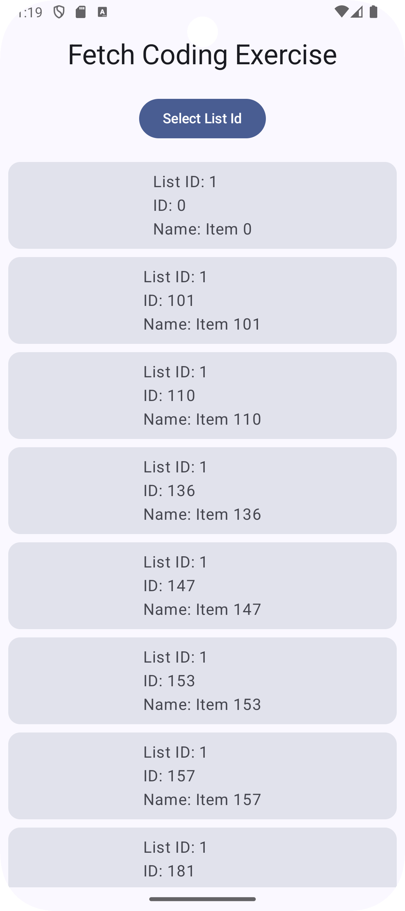
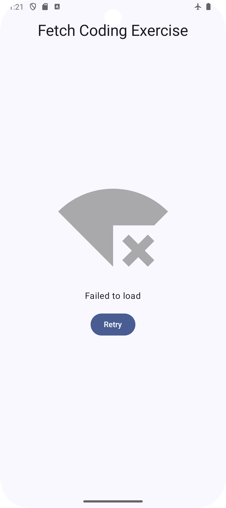
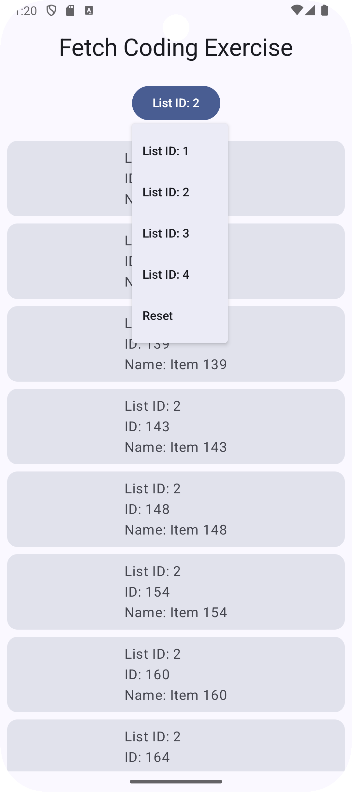
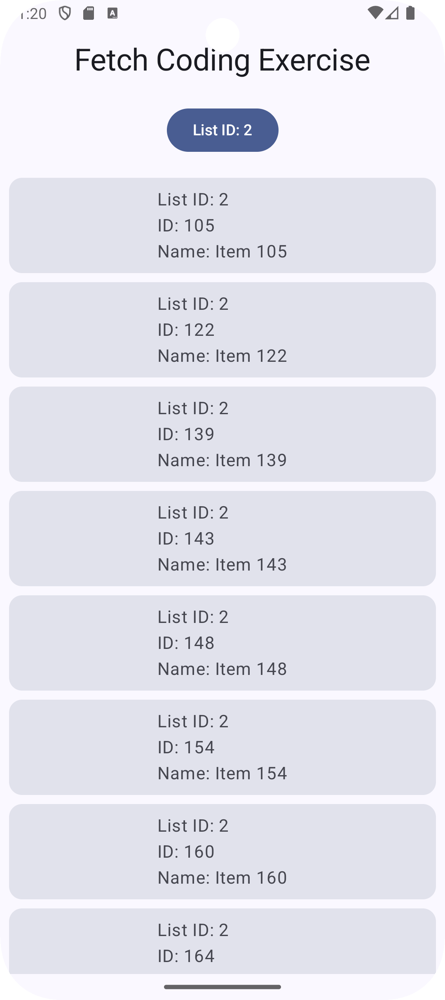

This Android application was developed as part of a coding exercise for an Android Developer interview. The app fetches a list of items from a remote API and displays them in a user-friendly interface. It organizes items by their `listId` and provides a dropdown menu to filter and view items by group. The app is built using **Jetpack Compose**, **Retrofit**, and follows clean architectural practices.

## Features
- **Data Fetching:** Retrieves item data from a remote API.
- **Filtering:** Filters out items with `null` or blank `name` values.
- **Sorting:** Sorts items first by `listId` and then by `name`.
- **Grouping:** Displays items grouped by `listId`.
- **Dropdown Selection:** Allows users to select a `listId` from a dropdown to filter items.
- **Loading State:** Displays a loading indicator while fetching data.
- **Error Handling:** Shows an error screen when data fetching fails.
- **Empty State:** Informs the user when no data is available.
- **Dependency Injection:** Utilizes Hilt for efficient and scalable dependency management.
- **Responsive UI:** Built with **Jetpack Compose** for a modern, smooth user experience.

##  Tech Stack
- **Language:** Kotlin
- **UI Framework:** Jetpack Compose
- **Networking:** Retrofit with Json Converter
- **Architecture:** MVVM (Model-View-ViewModel)
- **Coroutines:** For asynchronous operations

## Screenshots
### Home Screen

### Error Screen

### List Filter DropDown

### List Filter Selected

